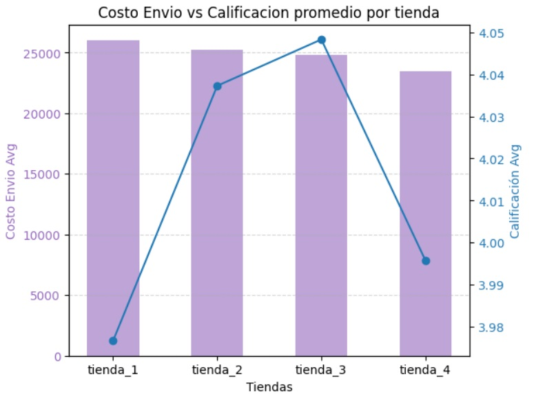

  

<h1 align="center">Análisis de Datos: [Primer_Challenge: Alura Store]</h1>

  Proyecto de análisis de datos usando Python, Matplotlib y Pandas.  
  Incluye visualizaciones, limpieza de datos y conclusiones clave.  

## Proposito del analisis realizado
En este proyecto se realiza el análisis de los datos de ventas de las 4 tiendas que posee el Sr. Juan con el objetivo de determinar aquella tienda que presente menor rendimiento en general tomando en cuenta 5 factores principales como son:

- Ingresos totales
- Categorias de productos mas y menos vendidas
- Calificaciones de los clientes
- Los productos más y menos vendidos
- Coste de envío promedio

De tal modo que luego de la venta de la tienda le permita poder hacer una inversión en otro rubro de mayor beneficio económico.

## Distribución de los archivos
En este proyecto se incluyen 3 archivos:
AluraStoreLatam.ipynb: Que incluye el detalle del analisis realizado con graficos que sustentan la recomendación final
README.md: Archivo de referencia con informacion importante.
informe: Que contiene el informe final en formato PDF.
Carpeta imagenes: carpeta que contiene las imagenes generadas en el proyecto.

## Insights obtenidos

  
  *Relacion entre los datos de Costos de envio y la Calificación promedio de los usuarios.*

---

## Instrucciones para ejecutar el notebook
Puedes bien descargar el archivo de Colab AluraStoreLatam.ipynb o tambien se incluye un link para directamente te diriga al notebook en colab.
Una vez abierto el archivo es posible visualizar todos el contenido ya ejecutado.

## Autor
Nombre: Luis Rivera Ramos  
Email: Luismrr.fie@gmail.com  
**Linkedin**: [https://www.linkedin.com/in/luis-miguel-rivera-ramos-0724b426b/]

